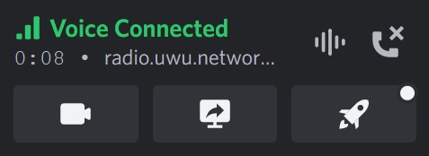
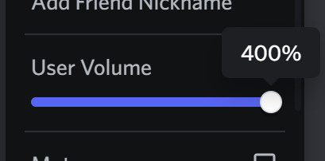

### <u><b>To install, copy the corresponding URL into <a href="https://github.com/uwu/shelter">shelter</a></b></u><br>

### [VC Timer](https://github.com/ioj4/shelter-plugins/tree/master/plugins/vc-timer/)

##### Displays how long you've been in a call or voicechat



```
https://ioj4.github.io/shelter-plugins/vc-timer/
```

### [Open Profile Images](https://github.com/ioj4/shelter-plugins/tree/master/plugins/open-profile-images/)

##### Allows you to open avatar or banner images by clicking on them


```
https://ioj4.github.io/shelter-plugins/open-profile-images/
```

### [Revert Font](https://github.com/ioj4/shelter-plugins/tree/master/plugins/revert-font/)

##### Reverts the font back to the old one


```
https://ioj4.github.io/shelter-plugins/revert-font/
```

### [Prevent Spotify Pause](https://github.com/ioj4/shelter-plugins/tree/master/plugins/prevent-spotify-pause/)

##### Prevents Discord from pausing your Spotify playback when you're in a call or voicechat


```
https://ioj4.github.io/shelter-plugins/prevent-spotify-pause/
```

### [No Call Idle](https://github.com/ioj4/shelter-plugins/tree/master/plugins/no-call-idle/) (temporary alternative to [redstonekasi](https://github.com/redstonekasi/shelter-plugins)'s plugin)

##### Prevents getting kicked from empty calls after 3 minutes

```
https://ioj4.github.io/shelter-plugins/no-call-idle/
```

### [Higher Volume Range](https://github.com/ioj4/shelter-plugins/tree/master/plugins/higher-volume-range) (currently broken)

##### Increases the range of all volume-sliders to 400%



```
https://ioj4.github.io/shelter-plugins/higher-volume-range/
```

### [Timestamp File Names](https://github.com/ioj4/shelter-plugins/tree/master/plugins/timestamp-file-names/)

##### Replaces the name of files you upload to the current Unix timestamp

`sensitive_file_name.png` → `1679770272381.png` (current timestamp)

```
https://ioj4.github.io/shelter-plugins/timestamp-file-names/
```

### [Play On Spotify](https://github.com/ioj4/shelter-plugins/tree/master/plugins/play-on-spotify/) (WIP)

##### Adds buttons to any Spotify link to open, queue or play a song in spotify (requires Spotify-Premium)

```
https://ioj4.github.io/shelter-plugins/play-on-spotify/
```

### [Show Username](https://github.com/ioj4/shelter-plugins/tree/master/plugins/show-username/) (forked from [Yellowsink](https://github.com/yellowsink/shelter-plugins))

##### When a user is nicked their username will be shown as well

```
https://ioj4.github.io/shelter-plugins/show-username/
```
