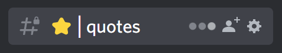
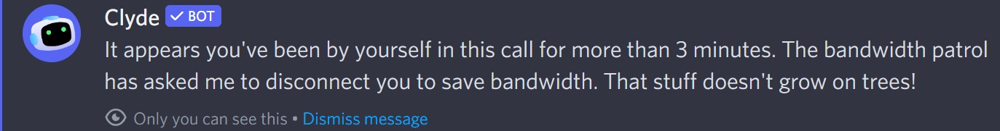

### <u><b>To install, copy the corresponding URL into <a href="https://github.com/uwu/shelter">shelter</a></b></u><br>

### [VC Timer](https://github.com/ioj4/shelter-plugins/tree/master/plugins/vc-timer/)

##### Displays how long you've been in a call or voicechat


```
https://shelter.ioj4.net/vc-timer/
```

### [Open Profile Images](https://github.com/ioj4/shelter-plugins/tree/master/plugins/open-profile-images/)

##### Allows you to open avatar or banner images by clicking on them


```
https://shelter.ioj4.net/open-profile-images/
```

### [Channel Typing Indicators](https://github.com/ioj4/shelter-plugins/tree/master/plugins/channel-typing-indicators/)

##### Shows an indicator when someone is typing in a channel



```
https://shelter.ioj4.net/channel-typing-indicators/
```

### [Revert Font](https://github.com/ioj4/shelter-plugins/tree/master/plugins/revert-font/)

##### Reverts the font back to the old one


```
https://shelter.ioj4.net/revert-font/
```

### [Prevent Spotify Pause](https://github.com/ioj4/shelter-plugins/tree/master/plugins/prevent-spotify-pause/)

##### Prevents Discord from pausing your Spotify playback when you're in a call or voicechat


```
https://shelter.ioj4.net/prevent-spotify-pause/
```

### [No Call Idle](https://github.com/ioj4/shelter-plugins/tree/master/plugins/no-call-idle/) (alternative to [redstonekasi's plugin](https://github.com/redstonekasi/shelter-plugins))

##### Prevents getting kicked from empty calls after 3 minutes



```
https://shelter.ioj4.net/no-call-idle/
```

### [Higher Volume Range](https://github.com/ioj4/shelter-plugins/tree/master/plugins/higher-volume-range) (currently broken)

##### Increases the range of all volume-sliders to 400%


```
https://shelter.ioj4.net/higher-volume-range/
```

### [Timestamp File Names](https://github.com/ioj4/shelter-plugins/tree/master/plugins/timestamp-file-names/)

##### Replaces the name of files you upload to the current Unix timestamp

`sensitive_file_name.png` → `1679770272381.png`

```
https://shelter.ioj4.net/timestamp-file-names/
```

### [Open In App](https://github.com/ioj4/shelter-plugins/tree/master/plugins/open-in-app/)

##### Clicking on Spotify or Steam links will open them directly in the app

```
https://shelter.ioj4.net/open-in-app/
```

### [Spotify Listen Along](https://github.com/ioj4/shelter-plugins/tree/master/plugins/spotify-listen-along/) (port of [Evelyn's plugin](https://github.com/Socketlike/SpotifyListenAlong/tree/main))

##### Allows you to use the 'Listen Along' feature without Spotify Premium, because Spotify Premium is not actually required

```
https://shelter.ioj4.net/spotify-listen-along/
```

### [Play On Spotify](https://github.com/ioj4/shelter-plugins/tree/master/plugins/play-on-spotify/) (WIP)

##### Adds buttons to any Spotify link to open, queue or play a song in spotify

```
https://shelter.ioj4.net/play-on-spotify/
```

### [Show Username](https://github.com/ioj4/shelter-plugins/tree/master/plugins/show-username/) (forked from [Yellowsink](https://github.com/yellowsink/shelter-plugins))

##### When a user is nicked their username will be shown as well

```
https://shelter.ioj4.net/show-username/
```
